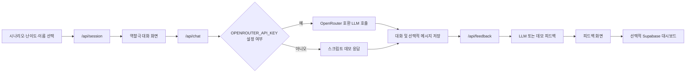

# AI 직무 롤플레이 시뮬레이터

[English](README.md)

> [프로젝트 자세히 보기](PORTFOLIO.ko.md)

고객 응대·면접·영업 대화를 연습하는 Next.js 애플리케이션입니다. 시나리오에 맞춘 LLM 대화 상대와 피드백 보고서를 제공하며, 선택적으로 Supabase에 세션 기록을 저장합니다.

> **범위 안내:** 저장소에는 소스 코드가 들어 있습니다. 배포 서비스, 사용자 연구, 응답 지연 시간, 채용 성과, 모델 품질 평가를 검증한 자료는 포함하지 않습니다. 피드백 점수는 LLM이 생성하는 연습용 의견이며, 검증된 평가나 자동 채용 판단에 사용하면 안 됩니다.

## 구현한 기능

- 고객 응대·면접·영업 3개 범주와 초급·중급·고급 3단계 프롬프트를 `lib/personas.ts`에 정의했습니다.
- `/api/session`에서 세션을 만들며, Supabase를 설정하지 않은 경우 UUID를 대신 사용합니다.
- `/api/chat`은 `OPENROUTER_API_KEY`가 있으면 OpenRouter 호환 클라이언트로 LLM을 호출하고, 없으면 미리 작성한 데모 응답을 반환합니다.
- `/api/feedback`은 강점·개선점과 네 가지 수치 점수를 요청합니다. API 키가 없을 때는 고정된 데모 피드백을 보여 줍니다.
- Google OAuth, Supabase 저장, 세션별 피드백, 로그인 사용자의 누적 피드백 대시보드는 선택 기능입니다.

## 앱 흐름



## 구조와 데이터 처리

| 계층 | 역할 | 근거 파일 |
|---|---|---|
| 클라이언트 | 시나리오 선택, 채팅, 피드백, 대시보드, webview 안내 | `app/`, `components/` |
| API | 세션 수명주기, 역할극 응답, 구조화된 피드백 요청 | `app/api/session/route.ts`, `app/api/chat/route.ts`, `app/api/feedback/route.ts` |
| LLM | persona 프롬프트와 OpenRouter 호환 chat completion | `lib/personas.ts`, API routes |
| 저장 | Supabase 브라우저 클라이언트와 sessions·messages·feedback 테이블 | `lib/supabase.ts`, `lib/auth.ts` |

Supabase 자격증명이 없으면 의도적으로 데모 경로를 사용합니다. 이때 피드백은 브라우저의 `sessionStorage`에만 남고, 영구적인 사용자 이력이 아닙니다.

## 환경 변수

사용할 연동만 골라 `.env.local`에 넣습니다.

```env
# 실제 LLM 경로를 켭니다. 없으면 고정 데모 응답을 반환합니다.
OPENROUTER_API_KEY=...

# 선택 사항. 소스 기본값은 google/gemini-2.0-flash-exp:free입니다.
OPENROUTER_MODEL=...

# 브라우저 인증과 데이터베이스 저장을 켭니다.
NEXT_PUBLIC_SUPABASE_URL=...
NEXT_PUBLIC_SUPABASE_ANON_KEY=...
```

타입 선언은 `sessions`, `messages`, `feedback` 테이블을 기대합니다. 다만 이 체크아웃에는 테이블 스키마와 RLS SQL이 버전 관리돼 있지 않으므로, 실제 연결 전에는 별도 설정과 접근 정책 검증이 필요합니다.

## 로컬 실행

```powershell
npm ci
npm run dev
```

Next.js가 출력하는 로컬 URL을 열면 됩니다. `npm run lint`와 `npm run build` 스크립트는 선언돼 있지만 이 문서 작성 과정에서 별도 실행하지 않았습니다.

## 피드백 점수의 사용 범위

피드백 API는 `total_score`, `empathy_score`, `problem_solving_score`, `communication_score`를 받습니다. 루브릭 보정 데이터, 사람 평가자 간 일치도, 테스트셋, 공정성 분석, 신뢰도 근거는 저장소에 없습니다. 이 결과는 연습을 돌아보기 위한 의견으로만 쓰고, 고용·교육·기타 고위험 판단에 사용하지 않습니다.

## 저장소 구조

```text
app/          # 세션·채팅·피드백 API와 화면
components/   # 인증 및 webview UI 보조 컴포넌트
lib/          # persona, Supabase 클라이언트, 인증 도우미
public/       # 로고와 favicon
```

## 한계와 다음 단계

- Supabase 스키마·RLS 정책·통합 테스트를 저장소에서 관리합니다.
- 문서화된 루브릭, 사람 검토, 신뢰도 측정으로 LLM 피드백을 검증합니다.
- 데모 모드의 클라이언트 입력을 제한하고, 악용 방지·rate limit·관측 기능을 추가합니다.

## 문서

- [포트폴리오 사례 연구](PORTFOLIO.ko.md)
- [프로젝트 리뷰](docs/PROJECT_REVIEW.md)
- [아키텍처](docs/ARCHITECTURE.md)
