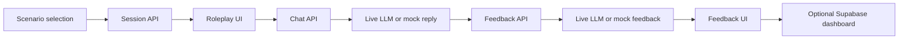

# Architecture

The application has two operational modes. Live mode sends scenario prompts and
conversation history to an OpenRouter-compatible LLM endpoint and can persist
data in Supabase. Demo mode returns checked-in mock replies and feedback so the
interface can be explored without external credentials.

The database path is conditional: the code writes sessions, messages, and
feedback only when its Supabase configuration check passes. Route-level details
are implemented in the application source tree.
